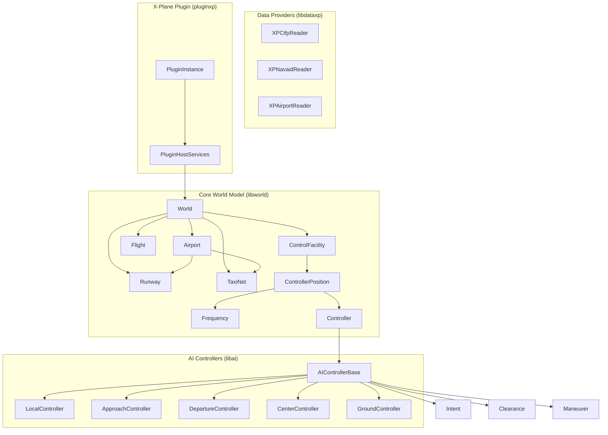
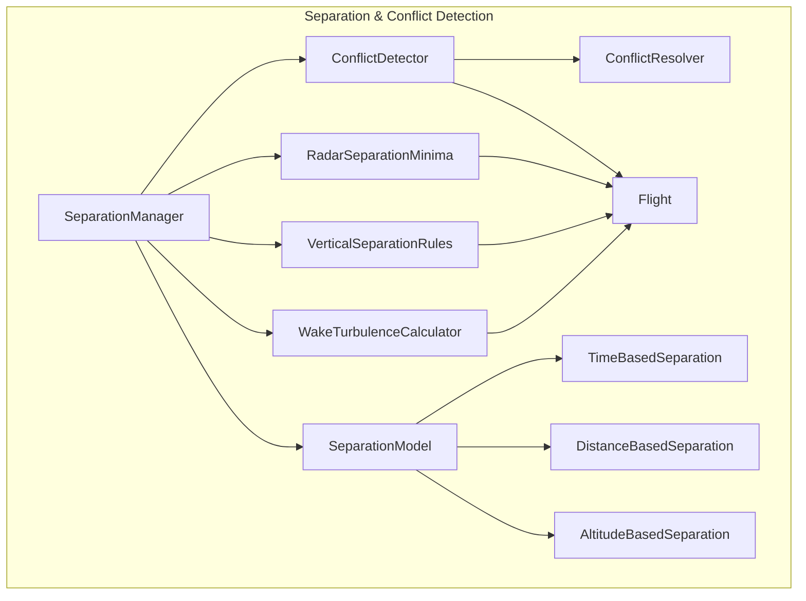
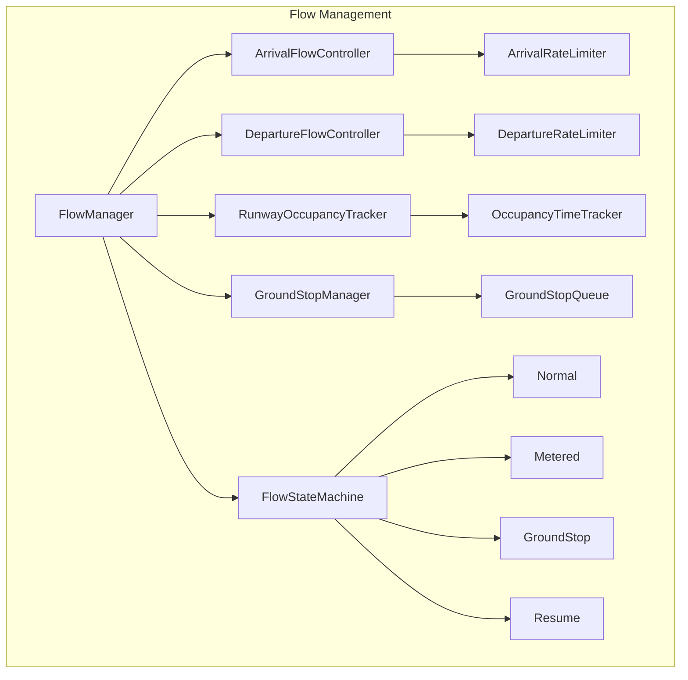
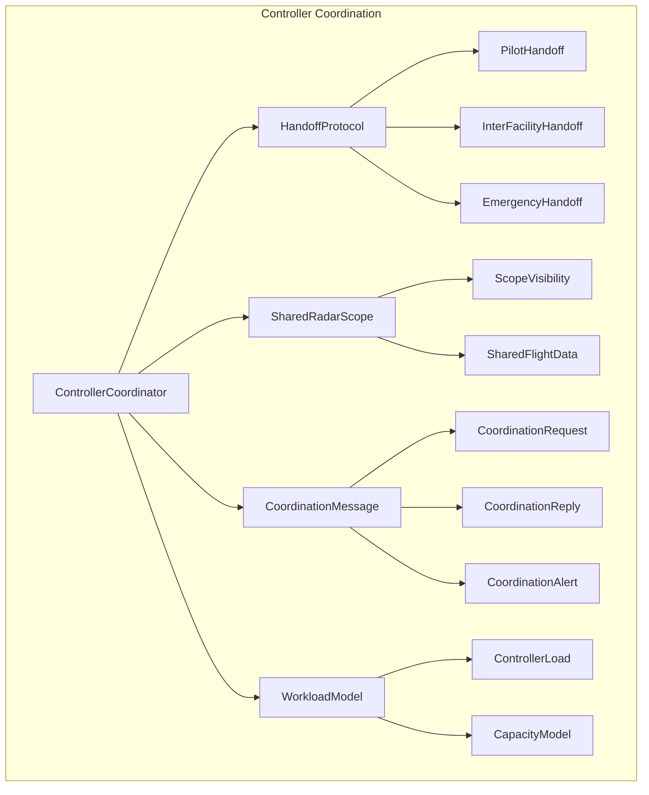
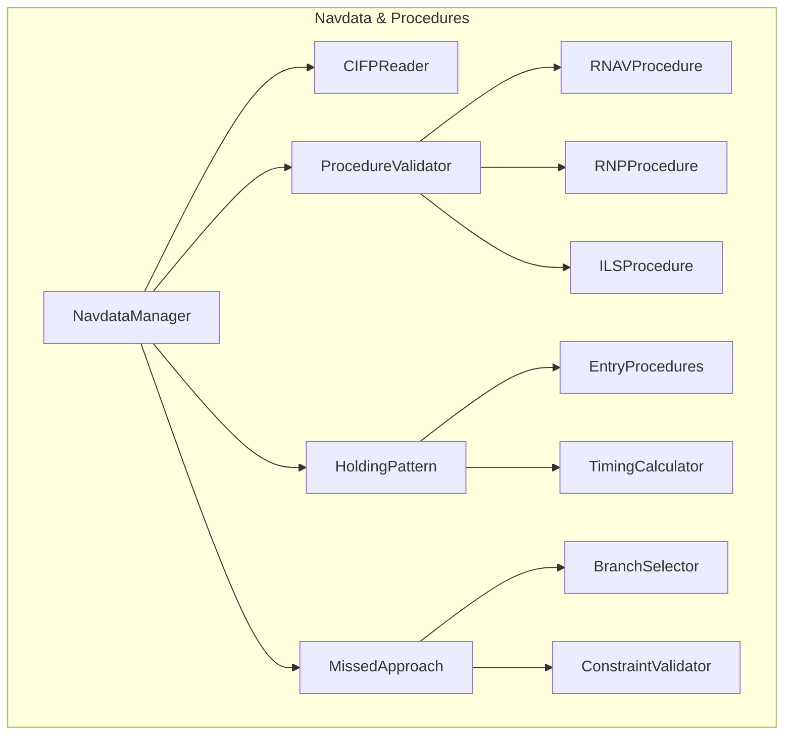
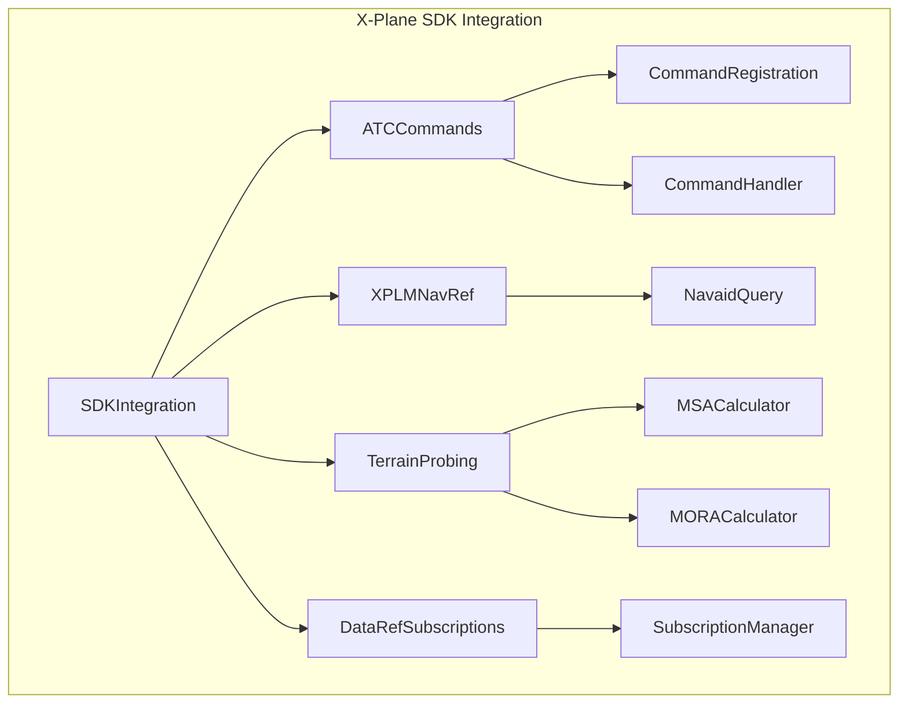
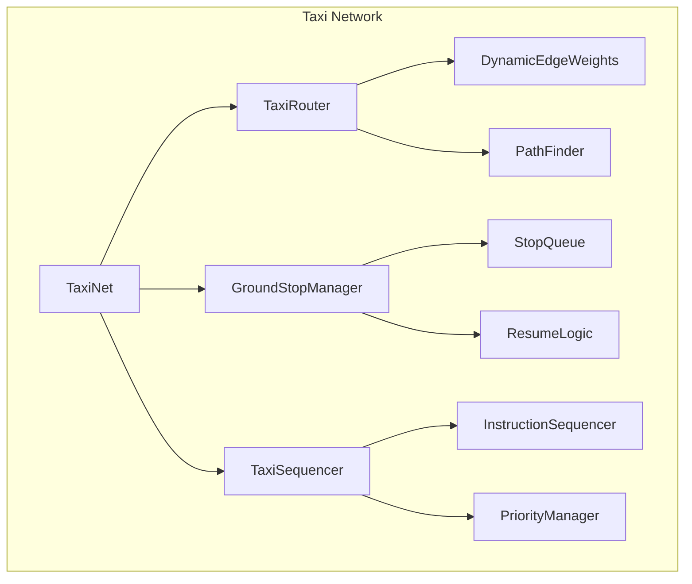
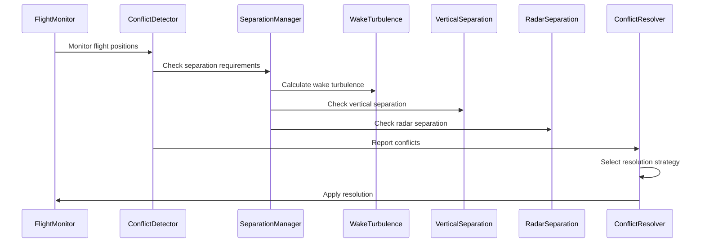
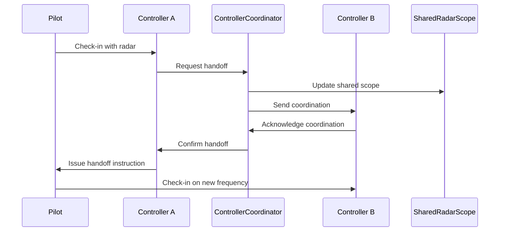

# MGGXPATC Architecture Refactoring Plan

## Overview

This document outlines the architectural refactoring plan for MGGXPATC to achieve lifelike ATC behavior. The current system provides basic ATC functionality but lacks sophisticated separation standards, flow management, and controller coordination found in real-world ATC operations.

## Current Architecture

### System Components

### Current Separation & Conflict Detection

The current system has limited separation logic:

- **Wake Turbulence**: Basic wake class inference in `SimpleRunwayMutex` with distance-based separation (3-8 NM)
- **Runway Separation**: Time-based separation for takeoff/landing using `TimingThresholds`
- **No Vertical Separation**: No altitude-based separation rules implemented
- **No Radar Separation**: No 3NM/5NM separation minima for enroute/approach
- **No Conflict Detection**: No proactive conflict detection or resolution algorithms

### Current Flow Management

- **AirportFlow**: Basic wind-based runway configuration selection
- **SimpleRunwayMutex**: Runway occupancy tracking with basic timing
- **No Flow Rates**: No arrival/departure rate limiting
- **No Ground Stop/Resume**: No ground stop logic for taxi operations
- **No Inter-facility Coordination**: No coordination between adjacent facilities

### Current Controller Coordination

- **Intent-based Communication**: Controllers communicate via `Intent` messages
- **Handoff Logic**: Basic handoff in `AIControllerBase::handoffTrackedFlightsToNextController()`
- **No Shared Radar Scope**: Each controller operates independently
- **No Workload Modeling**: No controller workload or capacity modeling

### Current Navdata Handling

- **CIFP Reader**: Reads procedures with altitude/speed constraints
- **Holding Patterns**: Not implemented (no timing or entry procedures)
- **Missed Approach**: Basic branching support in `readApproachProcedureTracks()`
- **No RNAV/RNP Validation**: No procedure validation against aircraft capabilities

### Current X-Plane SDK Integration

- **DataRefs**: Basic frequency and sim speed subscriptions
- **No Custom ATC Commands**: No XPLM API for ATC command registration
- **No Terrain Probing**: No MSA/MORA calculation via XPLM
- **No Navaid Queries**: Navaid data read from files, not XPLMNavRef

## Proposed Architecture Changes

### 1. Separation and Conflict Detection System

#### New Components

| Component | Description | Location |
|-----------|-------------|----------|
| `SeparationManager` | Central coordinator for all separation calculations | `libworld/separationManager.hpp` |
| `WakeTurbulenceCalculator` | Time-based wake turbulence separation | `libai/wakeTurbulence.hpp` |
| `VerticalSeparationRules` | 1000ft below FL290, 2000ft above | `libworld/verticalSeparation.hpp` |
| `RadarSeparationMinima` | 3NM approach, 5NM enroute | `libai/radarSeparation.hpp` |
| `ConflictDetector` | Proactive conflict detection | `libai/conflictDetector.hpp` |
| `ConflictResolver` | Resolution strategy selection | `libai/conflictResolver.hpp` |

#### Key Changes

1. **Wake Turbulence Separation** (`libai/wakeTurbulence.hpp`)
   - Convert current distance-based to time-based separation
   - Add time-to-vacate calculations
   - Implement ICAO Doc 4444 Table 8-1 standards
   - Add rotorcraft special cases

2. **Vertical Separation** (`libworld/verticalSeparation.hpp`)
   - Implement FL290 transition: 1000ft below, 2000ft above
   - Add RVSM compliance checks
   - Integrate with flight level assignment logic

3. **Radar Separation** (`libai/radarSeparation.hpp`)
   - Add 3NM minima for approach control
   - Add 5NM minima for enroute control
   - Implement separation monitoring loops

4. **Conflict Detection** (`libai/conflictDetector.hpp`)
   - Predict conflicts 1-5 minutes ahead
   - Calculate CPA (Closest Point of Approach)
   - Generate conflict alerts

### 2. Flow Management and Metering

#### New Components

| Component | Description | Location |
|-----------|-------------|----------|
| `FlowManager` | Central flow control coordinator | `libworld/flowManager.hpp` |
| `ArrivalFlowController` | Arrival rate management | `libai/arrivalFlowController.hpp` |
| `DepartureFlowController` | Departure rate management | `libai/departureFlowController.hpp` |
| `RunwayOccupancyTracker` | Runway occupancy time tracking | `libworld/runwayOccupancyTracker.hpp` |
| `GroundStopManager` | Ground stop/resume logic | `libai/groundStopManager.hpp` |
| `FlowStateMachine` | Flow control state machine | `libworld/flowStateMachine.hpp` |

#### Key Changes

1. **Arrival/Departure Flow Rates**
   - Add configurable arrival/departure rates per airport
   - Implement flow metering based on downstream capacity
   - Add flow control state transitions

2. **Runway Occupancy Time**
   - Track actual runway occupancy times
   - Use for separation calculations
   - Feed into flow rate calculations

3. **Ground Stop/Resume**
   - Implement ground stop for taxi operations
   - Add resume logic with time-based release
   - Coordinate with adjacent facilities

### 3. Controller Coordination

#### New Components

| Component | Description | Location |
|-----------|-------------|----------|
| `ControllerCoordinator` | Multi-controller coordination | `libai/controllerCoordinator.hpp` |
| `HandoffProtocol` | Handoff state machine | `libai/handoffProtocol.hpp` |
| `SharedRadarScope` | Shared radar data between controllers | `libworld/sharedRadarScope.hpp` |
| `CoordinationMessage` | Inter-facility coordination | `libai/coordinationMessage.hpp` |
| `WorkloadModel` | Controller workload tracking | `libai/workloadModel.hpp` |

#### Key Changes

1. **Multi-controller Handoff**
   - Add handoff state machine with timeouts
   - Implement coordination messages
   - Add handoff failure recovery

2. **Shared Radar Scope**
   - Share flight data between adjacent controllers
   - Implement scope visibility rules
   - Add radar contact handoff

3. **Coordination Messages**
   - Add coordination request/reply pattern
   - Implement coordination alerts
   - Add inter-facility coordination

4. **Workload Modeling**
   - Track controller workload metrics
   - Implement capacity-based flow control
   - Add workload-based handoff decisions

### 4. Enhanced Navdata Handling

#### New Components

| Component | Description | Location |
|-----------|-------------|----------|
| `NavdataManager` | Central navdata coordinator | `libdataxp/navdataManager.hpp` |
| `ProcedureValidator` | Procedure validation | `libdataxp/procedureValidator.hpp` |
| `HoldingPattern` | Holding pattern logic | `libdataxp/holdingPattern.hpp` |
| `HoldingEntry` | Entry procedure selection | `libdataxp/holdingEntry.hpp` |
| `MissedApproach` | Missed approach branching | `libdataxp/missedApproach.hpp` |

#### Key Changes

1. **RNAV/RNP Support**
   - Add procedure type detection
   - Implement RNP AR validation
   - Add aircraft capability checking

2. **Holding Pattern Timing**
   - Implement standard holding timing (1 min/1.5 min)
   - Add entry procedure selection (direct, parallel, teardrop, overhead)
   - Calculate outbound leg timing

3. **Missed Approach Branching**
   - Add branch selection logic
   - Implement constraint validation
   - Add missed approach point detection

4. **Altitude/Speed Constraint Validation**
   - Validate constraints against aircraft performance
   - Add constraint compliance monitoring
   - Implement constraint violation alerts

### 5. X-Plane SDK Integration Improvements

#### New Components

| Component | Description | Location |
|-----------|-------------|----------|
| `SDKIntegration` | X-Plane SDK integration manager | `pluginxp/sdkIntegration.hpp` |
| `ATCCommands` | Custom ATC command registration | `pluginxp/atcCommands.hpp` |
| `XPLMNavRef` | Navaid query wrapper | `pluginxp/xplmNavRef.hpp` |
| `MSACalculator` | Minimum Safe Altitude calculation | `pluginxp/msaCalculator.hpp` |
| `MORACalculator` | Minimum Vectoring Altitude | `pluginxp/moraCalculator.hpp` |
| `SubscriptionManager` | DataRef subscription manager | `pluginxp/dataRefSubscriptionManager.hpp` |

#### Key Changes

1. **Custom ATC Commands**
   - Register ATC commands with XPLM API
   - Add command handlers for ATC actions
   - Implement command feedback to X-Plane

2. **Navaid Queries**
   - Use XPLMNavRef for navaid lookups
   - Add navaid type filtering
   - Implement navaid proximity queries

3. **Terrain Probing**
   - Implement MSA calculation via XPLM terrain probe
   - Add MORA grid generation
   - Integrate with altitude constraint validation

4. **DataRef Subscriptions**
   - Add subscription manager for efficient updates
   - Implement change notification callbacks
   - Add subscription lifecycle management

### 6. Taxi Network Enhancements

#### New Components

| Component | Description | Location |
|-----------|-------------|----------|
| `TaxiRouter` | Enhanced taxi routing | `libworld/taxiRouter.hpp` |
| `DynamicEdgeWeights` | Dynamic edge weight calculation | `libworld/dynamicEdgeWeights.hpp` |
| `TaxiSequencer` | Taxi instruction sequencing | `libai/taxiSequencer.hpp` |
| `GroundStopManager` | Ground stop/resume logic | `libai/groundStopManager.hpp` |

#### Key Changes

1. **Dynamic Edge Weights**
   - Add time-based edge weights
   - Implement congestion-aware routing
   - Add priority-based weight adjustments

2. **Ground Stop/Resume**
   - Implement ground stop for taxi operations
   - Add resume logic with time-based release
   - Coordinate with flow management

3. **Taxi Instruction Sequencing**
   - Add instruction sequencing logic
   - Implement hold-short timing
   - Add crossing clearance coordination

## Data Flow for Separation/Conflict Detection

## Event Flow for Controller Coordination

## Migration Path for Existing Code

### Phase 1: Foundation (Separation & Conflict Detection)

1. Create `SeparationManager` in `libworld/separationManager.hpp`
2. Extract wake turbulence logic from `SimpleRunwayMutex` to `WakeTurbulenceCalculator`
3. Add `VerticalSeparationRules` for altitude-based separation
4. Implement `ConflictDetector` with CPA calculations
5. Integrate with existing `SimpleRunwayMutex`

### Phase 2: Flow Management

1. Create `FlowManager` in `libworld/flowManager.hpp`
2. Add `RunwayOccupancyTracker` for time tracking
3. Implement `FlowStateMachine` for state transitions
4. Integrate with `AirportFlow` for runway selection
5. Add rate limiting to `LocalController`

### Phase 3: Controller Coordination

1. Create `ControllerCoordinator` in `libai/controllerCoordinator.hpp`
2. Add `HandoffProtocol` state machine
3. Implement `SharedRadarScope` for data sharing
4. Add `WorkloadModel` for capacity tracking
5. Refactor handoff logic in `AIControllerBase`

### Phase 4: Navdata Enhancements

1. Create `NavdataManager` in `libdataxp/navdataManager.hpp`
2. Add `HoldingPattern` with entry procedures
3. Implement `ProcedureValidator` for RNAV/RNP
4. Enhance `XPCifpReader` for missed approach
5. Add constraint validation logic

### Phase 5: SDK Integration

1. Create `SDKIntegration` in `pluginxp/sdkIntegration.hpp`
2. Add `ATCCommands` registration
3. Implement `XPLMNavRef` wrapper
4. Add `MSACalculator` and `MORACalculator`
5. Create `SubscriptionManager` for DataRefs

### Phase 6: Taxi Network

1. Create `TaxiRouter` with dynamic weights
2. Add `TaxiSequencer` for instruction management
3. Integrate with `GroundStopManager`
4. Enhance `TaxiNet` with new routing logic
5. Add priority-based taxi management

## File Changes Summary

### New Files to Create

| File | Purpose |
|------|---------|
| `libworld/separationManager.hpp` | Central separation coordination |
| `libai/wakeTurbulence.hpp` | Wake turbulence calculations |
| `libworld/verticalSeparation.hpp` | Vertical separation rules |
| `libai/radarSeparation.hpp` | Radar separation minima |
| `libai/conflictDetector.hpp` | Conflict detection algorithms |
| `libai/conflictResolver.hpp` | Conflict resolution strategies |
| `libworld/flowManager.hpp` | Flow management coordinator |
| `libai/arrivalFlowController.hpp` | Arrival rate control |
| `libai/departureFlowController.hpp` | Departure rate control |
| `libworld/runwayOccupancyTracker.hpp` | Runway time tracking |
| `libai/groundStopManager.hpp` | Ground stop logic |
| `libworld/flowStateMachine.hpp` | Flow state machine |
| `libai/controllerCoordinator.hpp` | Multi-controller coordination |
| `libai/handoffProtocol.hpp` | Handoff state machine |
| `libworld/sharedRadarScope.hpp` | Shared radar data |
| `libai/coordinationMessage.hpp` | Coordination messages |
| `libai/workloadModel.hpp` | Workload tracking |
| `libdataxp/navdataManager.hpp` | Navdata coordination |
| `libdataxp/procedureValidator.hpp` | Procedure validation |
| `libdataxp/holdingPattern.hpp` | Holding pattern logic |
| `libdataxp/holdingEntry.hpp` | Entry procedure selection |
| `libdataxp/missedApproach.hpp` | Missed approach logic |
| `pluginxp/sdkIntegration.hpp` | SDK integration manager |
| `pluginxp/atcCommands.hpp` | ATC command registration |
| `pluginxp/xplmNavRef.hpp` | Navaid query wrapper |
| `pluginxp/msaCalculator.hpp` | MSA calculation |
| `pluginxp/moraCalculator.hpp` | MORA calculation |
| `pluginxp/dataRefSubscriptionManager.hpp` | DataRef subscriptions |
| `libworld/taxiRouter.hpp` | Enhanced taxi routing |
| `libworld/dynamicEdgeWeights.hpp` | Dynamic edge weights |
| `libai/taxiSequencer.hpp` | Taxi instruction sequencing |

### Files to Modify

| File | Changes |
|------|---------|
| `libai/simpleRunwayMutex.hpp` | Extract wake turbulence, use SeparationManager |
| `libai/aiControllerBase.hpp` | Integrate ControllerCoordinator, use HandoffProtocol |
| `libai/localController.hpp` | Use FlowManager, integrate TaxiSequencer |
| `libai/approachController.hpp` | Add RadarSeparationMinima, use ConflictDetector |
| `libworld/airport.cpp` | Integrate FlowManager, add occupancy tracking |
| `libworld/taxiNet.cpp` | Add dynamic edge weights, integrate TaxiRouter |
| `libdataxp/xpCifpReader.hpp` | Add holding pattern, missed approach support |
| `pluginxp/pluginInstance.hpp` | Register ATC commands, use SDKIntegration |
| `libworld/world.h` | Add SeparationManager, FlowManager, SharedRadarScope |

## Implementation Priority

1. **High Priority**: Wake turbulence time-based separation, vertical separation rules, radar separation minima
2. **Medium Priority**: Flow management, controller coordination, conflict detection
3. **Low Priority**: Navdata enhancements, SDK integration, taxi network improvements

## Testing Strategy

- Unit tests for each new component
- Integration tests for separation/conflict detection
- Scenario tests for flow management
- End-to-end tests for controller coordination
